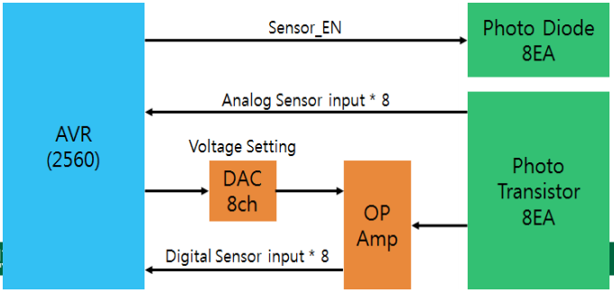

### <----- unconverted ------------------->
### <----- converted ------------------->


*slide #1*

## Smart Software Project

### Lab: Week 8

### Bluetooth Comm.with Android Dev.

### Prof. HyungJune Lee
#### hyungjune.lee@ewha.ac.kr


*slide #2*

#### Today

- Lab announcement

- Infrared sensor

- Lab assignment #7

- Course announcement


*slide #3*

# Class Schedule

| Week    | Lecture Contents    | Lab Contents                                             |
|---------|---------------------|----------------------------------------------------------|
| Week 1  | Course introduction | Arduino introduction: platform & programming environment |
| Week 2  | Embedded system overview & source management in collaborative repository (using GitHub) | Lab 1: Arduino Mega 2560 board &SmartCAR platform |
| Week 3  | ATmega2560 Micro-controller (MCU): architecture & I/O ports, Analog vs. Digital, Pulse Width Modulation  |Lab 2: SmartCAR LED control |
| Week 4  | Analog vs. Digital & Pulse Width Modulation  |Lab 3: SmartCAR motor control (Due: HW on creating project repository using GitHub) |
| week 5  | ATmega2560 MCU: memory, I/O ports, UART  |Lab 4: SmartCAR control via Android Bluetooth |
| week 6  | ATmega2560 UART control & Bluetooth communication between Arduino platform and Android device  |Lab 5: SmartCAR control through yourown customized Android app (Due: Project proposal) |
| week 7  | Midterm exam |  |
| week 8  | ATmega2560 Timer, Interrupts & Ultrasonic sensors  |Lab 6: SmartCAR ultrasonic sensing |
| week 9  | Infrared sensors & Buzzer  |Lab 7: SmartCAR infrared sensing |
| week 10 | Acquiring location information from Android device & line tracing  |Lab 8: Implementation of line tracer |
| week 11 | Gyroscope, accelerometer, and compass sensors  |Lab 9: Using gyroscope,accelerometer, and compass sensors |
| week 12 | Project | Team meeting (for progress check) |
| week 13 | Project | Team meeting (for progress check) |
| week 14 | Course wrap-up & next steps |  |
| week 15 | Project | presentation & demo I (Due: source code, presentation slides, & poster slide) Project presentation & demo II |
| week 16 | Final week (no final exam) | |

*slide #4*

#### Lab Session

- Practice in-lab programming exercises based on the lecture materials.

- Upload source codes for lab assignments in Ewha Cyber Campus after the lab session Due: 11:59pm on the lab day.

- Once you are done, you can leave the session after checking with me or TA Or, continue to work on programming for other homework assignments.

#### Lab Policy

1) Please check out your SmartCAR (& Nexus 7 tablet) as soon as you arrive at the classroom.

2) Please complete lab assignments.

3) Upload required files to Ewha Cyber Campus.

4) Check with me or TA.

5) Please upload a null firmware to SmartCAR before you return it!!! This will be a part of your lab score!

6) Please remove files that you created or downloaded in your computer after you are done. **Remove your project completely.**

7) Please shut down your computer before you leave.

8) Return the checked-out SmartCAR (& Nexus 7 tablet) to TA


*slide #x*

#### How to run SmartCAR in Lab

- Power OFF

- Compile your code

- Lift up your SmartCAR with your hand

- Upload your code

- Disconnect the USB cable

- Go to find a spacious area

- Put it down there

- Power ON

- It will run your firmware

- After test, turn power OFF


*slide #7*

#### Lab Announcement

* **Bluetooth pairing "headache"**

  * Cause : there are many Bluetooth devices in the classroom with the very similiar same names.
  * **Remedy 1 :** Identify which device is yours by it's hardware ID.
  * **remedy 2 :** Find a place with few or no other devices to interfere with pairing.
    * *Go outside with your SmartCAR and your Android device and pair there!*
    * **Do not pair with other students cars!!**


*slide #8*

#### Today

* Lab announcement
* Infrared sensor
* Lab assignment #7
* Course announcement


*slide #9*

#### Infrared Sensors in SmartCAR

* ```Sensor_EN```  Enables infrared sensors
* ```Analog sensor input``` Measure infrared level in analog.
* ``Digital sensor input``` Measure infrared level in digital.
* Block diagram of infrared sensors in SmartCAR



*slide #10*

#### SmartCAR Infrared Sensor Port Configuration


| Type    | Name             | Port / Number                                             |
|---------|------------------|-----------------------------------------------------------|
|  Digital Inputs | SENSOR_1 (LEFTMOST) | PC7 / 30 |
| | SENSOR_2 | PC6 / 31 |
| | SENSOR_3 | PC5 / 32 |
| | SENSOR_4 | PC4 / 33 |
| | SENSOR_5 | PC3 / 34 |
| | SENSOR_6 | PC2 / 35 |
| | SENSOR_7 | PC1 / 36 |
| | SENSOR_8 (RIGHTMOST) | PC0 / 37 |
| Analog Inputs | SENA_1 (LEFTMOST) | PF0 / A0 |
| | SENA_2 | PF1 / A1 |
| | SENA_3 | PF2 / A2 |
| | SENA_4 | PF3 / A3 |
| | SENA_5 | PF4 / A4 |
| | SENA_6 | PF5 / A5 |
| | SENA_7 | PF6 / A6 |
| | SENA_8 (RIGHTMOST) | PF7 / A7 |
| | SEN_EN | PA4 / 26 |
|  DAC |S_DIN | PL7 / 42 |
| | S_SCLK | PL6 / 43 |
| | S_SYNCN | PL5 / 44 |

*synopsis*

* 30~37: ports to read digital values at receiver based on reference voltage set-up in OP AMP
* A0~A7: ports to read analog values at receiver
* 26: enable infrared emitter - ‘1’ turning on emitter
* 42~44: ports for configuring reference voltage in Serial DAC
  * Configure reference voltages for 8 pins in OP AMP

```
!! need image !!

```

*slide #11*

#### Part I: Serial DAC Control

```cpp
void DAC_CH_Write(unsigned int ch, unsigned int da)
{
    unsigned int data = ((ch << 12) & 0x7000) |
    ((da << 4) & 0x0FF0);
    DAC_setting(data);
}
void DAC_setting(unsigned int data)
{
    int z;
    digitalWrite(S_SCLK,HIGH);
    delayMicroseconds(1);
    digitalWrite(S_SCLK,LOW);
    delayMicroseconds(1);
    digitalWrite(S_SYNCN,LOW);
    delayMicroseconds(1);
    for(z=15;z>=0;z--)
    {
        digitalWrite(S_DIN,(data>>z)&0x1);
        digitalWrite(S_SCLK,HIGH);
        delayMicroseconds(1);
        digitalWrite(S_SCLK,LOW);
        delayMicroseconds(1);
    }
    digitalWrite(S_SYNCN,HIGH);
}
```

### <----- unconverted ------------------->
12 4
should be LOW
should be HIGH -> LOW

### <----- converted ------------------->

*slide #12*

#### Threshold for Digital Sensor Input Decision

```cpp
#define S_DIN 42
#define S_SCLK 43
#define S_SYNCN 44
#define IN_SEN_EN 26
int SensorA[8] = {A0,A1,A2,A3,A4,A5,A6,A7};
int SensorD[8] = {30,31,32,33,34,35,36,37};
void setup()
{
    int z;
    int dac_val_min[8] =
    {59,94,81,79,166,104,108,77};
    int dac_val_max[8] =
    {443,627,678,603,957,761,797,559};
    Serial.begin(115200);
    pinMode(IN_SEN_EN,OUTPUT);
    pinMode(S_DIN,OUTPUT);
    pinMode(S_SCLK,OUTPUT);
    pinMode(S_SYNCN,OUTPUT);
    digitalWrite(S_SCLK,LOW);
    digitalWrite(S_SYNCN,HIGH);
    digitalWrite(IN_SEN_EN,HIGH);
    Mode DB[15:12] DB[11:0] Etc
    WRM 1000 XXXX XXXX XXXX 0x8000
    WTM 1001 XXXX XXXX XXXX 0x9000
    for (z=0; z<8; z++)
    pinMode(SensorD[z], INPUT);
    DAC_setting(0x9000); //for Write-Through Mode
    for (z=0; z<8; z++)
    {
        int mean_val =
        (dac_val_min[z]+dac_val_max[z])/2; //10-bit
        DAC_CH_Write(z, mean_val >> 2);
        //should be 8-bit
    }
}
```

### <----- unconverted ------------------->


Print measurements to UART
• If the SmartCAR receives a
byte of 11, it prints out
– analog values
– digital values
from 8 infrared sensors


13
### <----- converted ------------------->
```cpp
void infrared_sensor_read()
{
    int z;
    for(z=7;z>=0;z--)
    {
        unsigned int val = analogRead(SensorA[z]);
        Serial.print(val);
        Serial.print(" ");
    }
    Serial.println("");
    for(z=7;z>=0;z--)
    {
        unsigned int val = digitalRead(SensorD[z]);
        Serial.print(val);
        Serial.print(" ");
    }
}
void serialEvent()
{
    int command = Serial.read();
    switch (command)
    {
        ...
        ...
        case 11:
        infrared_sensor_read();
        break;
        default:
    }
}
```

### <----- unconverted ------------------->


Part II: SmartCAR Control App
• http://ai2.appinventor.mit.edu
• Click on “New Project”
• Enter “SmartCAR_Ctr” in Project Name (One word, no space)
• Under “User Interface”
– Drag-and-drop “ListPicker” component
• To select a Bluetooth device
– Drag-and-drop “Button” component
– Drag-and-drop “Label” component
• Under “Layout”
– Drag-and-drop “TableArrangement”
– Drag-and-drop “TableArrangement”
• Under “Connectivity”
– Drag-and-drop “BluetoothClient”
• Uncheck “Secure”
• Under “Sensors”
– Drag-and-drop “AccelerometerSensor”
BTOutput (Label) 14
SmartCAR Sensor Control
• Sensing Ultrasonic sensor
(command byte: 10)
– Send “10” in number using
“BluetoothClient.Send1ByteNumber”
• Sensing Infrared sensor
(command byte: 11)
– Send “11” in number using
“BluetoothClient.Send1ByteNumber”
15
Receiving Bytes from SmartCAR
• Use “Clock” component: timer functionality
– To periodically check whether any data have been received from
Bluetooth
– TimerAlwaysFires? : to select whether to expire periodically or not
– TimerEnabled : to select whether to initially enable or not
– TimerInterval : timer interval in ms
16
Receiving Bytes from SmartCAR
• 1) When Bluetooth is connected, then the timer is
enabled
• 2) When “Timer” expires, check if there are received
data
– If so, print them to a label
17
1)
2)
How to Run your Android app
• 1. Install “QR Barcode Scanner”
in Play Store (Android device)
• 2. Click on “Build” (PC)
– Click on “App (provide QR code for .apk)”
• 3. Run “QR Barcode Scanner”
(Android device)
• 4. Touch the URL link
(Android device)
• 5. Select “OK” to install .apk file
(Android device)
18
Summary of Steps
• 1) Run an application to measure analog values
– Remove the blue codes in SmartCAR firmware
– Measure Analog Infrared Sensor Value on “White”
– Measure Analog Infrared Sensor Value on “Black”
• 2) Add the voltage setup for digital in setup()
– Add the blue codes with the measured values
– Set up the average value
• 3) Run an application to measure analog values
as well as digital values
19
Lab Assignment #7
• Submit three following files to Cyber Campu
s
– 1) lab7.cpp (Arduino firmware code)
– 2) lab7.h (Arduino firmware code)
– 3) SmartCAR_IR.apk (Android app package)
• You should set the app icon image to “SmartCAR.png”
• In App Inventor,
“Build” è “App (save .apk to my computer)”
• Show your result to TA or instructor
20
Course Announcement
• Next Week Lab session,
– Line tracing using infrared sensors
– Getting location information from Android
device
21