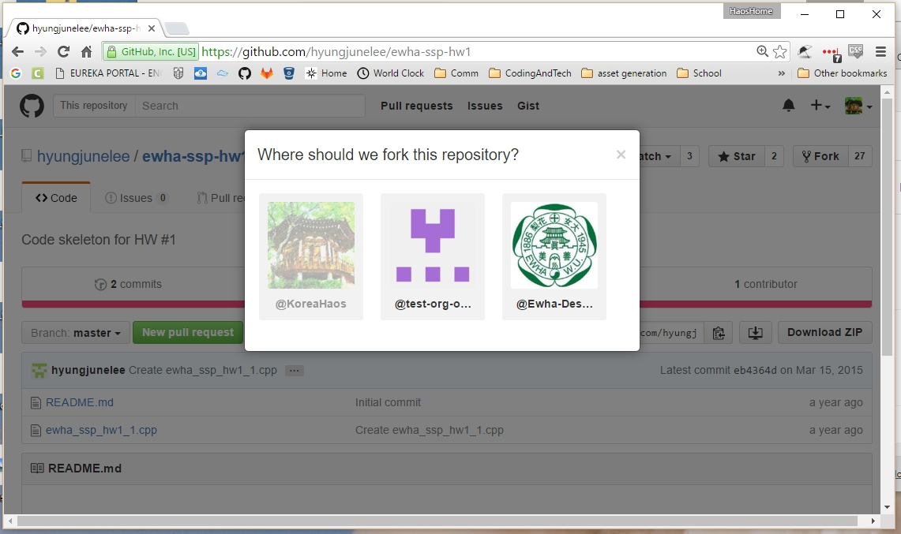
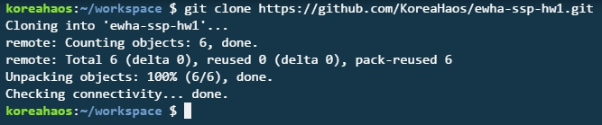
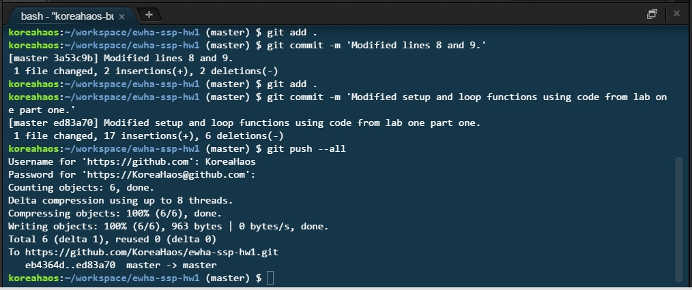

# Homework Assignment One, part One. (1.1)

## Fork Professor's Repository:

### *(**Proof :**)*

## Clone forked repository to a local machine.

### *(**Proof :**)*

## Push your changes to GitHub.

### *(**Proof :**)*

