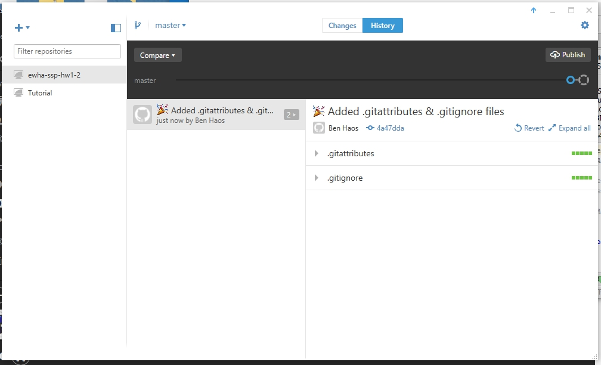
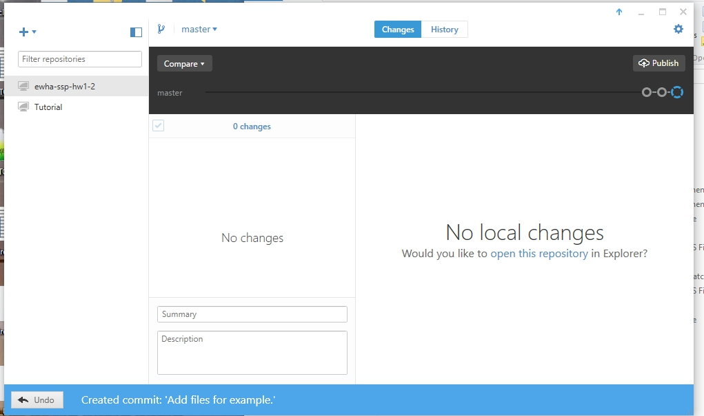

# Homework Assignment One, part Two. (1.2)

* **Synopsis** : Using an Androx working directory on a local computer along with the GitHub GUI you will create a repository, track changes, and push to a remote GitHub repository.

* **Problems** : I do not have a 'Androx working directory' as i have not installed androx on my local machine and i hope i am not required to. I propose use of The CodeBender IDE be allowed as it allows my work-flow to be more efficient, colabrative, and portable.

* **Assignment Completion to Prove Skill Being Tested**:

  * **First**, i created a example project using Android Studio.

  * **Second**, using the GitHub GUI client, i create repository with the requested name using the direction provided in the slide referenced.

  * *I then, as i expected, found that the GitHub GUI client created a repo inside the directory i browsed to as directed. Even though i will destroy my projects file structure, i moved all the files into the repository directory.*

  * **Next**, my Changes causes the GitHub GUI client to observe changes and allow for a add/commit function to be done. I did this.

  * **Finally**, i then published it to GitHub.

URL : https://github.com/KoreaHaos/ewha-ssp-hw1-2

