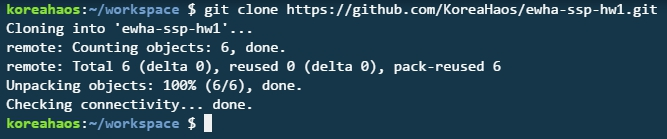
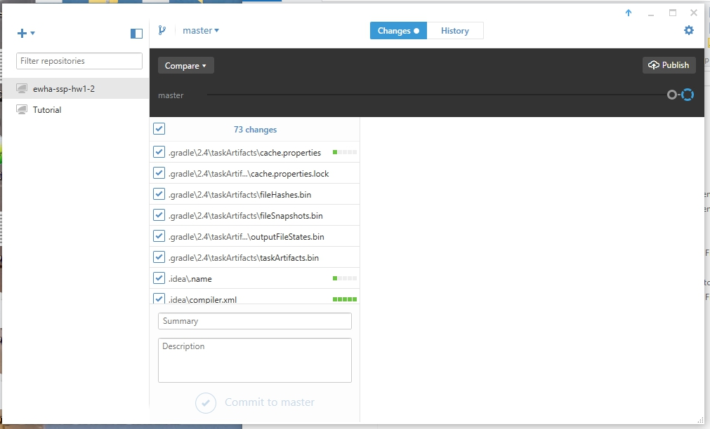
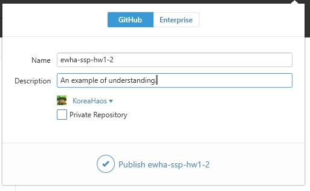

.

.

.

.

.
# Smart Software Project

## Homework Assignment One

# Hello GitHub World!

## By : Prof. HyungJune Lee

#### Assignment completed by : Benjamin Haos (IES15718)

.

.

.

.

.

.

.

.

.

.

.

.

# Homework Assignment One!

* **Due:** Mar 28th 2016 by 2pm. *(Monday before class starts and **Don't be late to class!**)*

* Submissions **Requirements**:
  * **Digital** file upload.
  * **Physical Hardcopy** of file, delivered to inbox *(see below for location)*.

* URL for part one : https://github.com/KoreaHaos/ewha-ssp-hw1
* URL for part two : https://github.com/KoreaHaos/ewha-ssp-hw1-2

* Additional URLs:
 * Main/Workspace URL at GitLab : https://gitlab.com/koreahaos/37269_01_smart_software_project
 * URL for Cloud9VM : https://ide.c9.io/koreahaos/burn_me_now

.

.

.

.

.

.

.

.

.

.

# Smart Software Project

## Homework Assignment One

# Hello GitHub World!

## taught by : Prof. HyungJune Lee 

#### Assignment completed by : Benjamin Haos (IES15718)

## Homework Assignment One, part One. (1.1)

#### Once you have completed the above:

* Submit the URL for the remote repository created above.
  * *HINT* - This URL will be formatted as such `https://github.com/<YOUR_GITHUB_USER_NAME>/<YOUR_GITHUB_REPO'S_NAME>[/<THERE_MAY_OR_MAY_NOT_BE_ADDITIONAL_DATA_HERE>]`
* Your grade will be largely based on the public repository you create...

#### Once you have completed the above:

* Submit the URL for the remote repository created above.
  * *HINT* - This URL will be formatted as such `https://github.com/<YOUR_GITHUB_USER_NAME>/ewha-ssp-hw1-2`
* Your grade will be largely based on the public repository you create...

Include:
* **Title Page**.
  * Student ID.
  * Your Name.
* Two repository URLs showing public locations of HW #1-1, #1-2.
* Step-by-step screen capture with brief explanation.
* What you learned from this homework.

### **Upload to Cyber Campus upload requirement**:

* PDF file of report.

### **Hardcopy Submission requirement**:

* Printout of file pdf file submmitted to Cyber Campus.
* Location for physical submission : HW box (이형준, HyungJune Lee) in front of Asan 221-1

*As stated above:*

* **Due:** Mar 28th 2016 by 2pm. *(Monday before class starts)*

# Homework Assignment One, part One. (1.1)

## Fork Professor's Repository:

### *(**Proof :**)*

## Clone forked repository to a local machine.

### *(**Proof :**)*

## Push your changes to GitHub.

### *(**Proof :**)*

# Homework Assignment One, part Two. (1.2)

* **Synopsis** : Using an Androx working directory on a local computer along with the GitHub GUI you will create a repository, track changes, and push to a remote GitHub repository.

* **Problems** : I do not have a 'Androx working directory' as i have not installed androx on my local machine and i hope i am not required to. I propose use of The CodeBender IDE be allowed as it allows my work-flow to be more efficient, colabrative, and portable.

* **Assignment Completion to Prove Skill Being Tested**:

#### Using GitHub Client

* Create a repository named `ewha-ssp-hw1-2`

  * **First**, i created a example project using Android Studio.

* Refer to Question 1, Case 2 in the Lecture slides.

  * **Second**, using the GitHub GUI client, i create repository with the requested name using the direction provided in the slide referenced.

  * *I then, as i expected, found that the GitHub GUI client created a repo inside the directory i browsed to as directed. Even though i will destroy my projects file structure, i moved all the files into the repository directory.*

  * **Next**, my Changes causes the GitHub GUI client to observe changes and allow for a add/commit function to be done. I did this.

  * **Finally**, i then published it to GitHub.

URL : https://github.com/KoreaHaos/ewha-ssp-hw1-2

# Initial Creation of Workspace and Repository

This repository and homework assignment includes multiple, unrequired, aspects.

The reasons i did this are multiple :

1. *MAIN REASON* To complete the assignment!
2. *SUB-MAIN REASON* To create a set of documents that might assist my lab partner to more fully understand the learning objectives of the assignment.
3. *SUB-SUB REASON* To excerise and develop my skills.
4. ...

## Online/Cloud Tools Utilized :

* [Cloud9](https:c9.io)
* [GitLab](https://gitlab.com)

### Sources :

### The Browser Dumps!

### Creation of Initial Repository :

*Browser 1* :

https://ide.c9.io/koreahaos/burn_me_now#openfile-README.md
http://stackoverflow.com/questions/1250079/how-to-escape-single-quotes-within-single-quoted-strings
http://superuser.com/questions/950196/show-the-date-on-the-system-tray-in-windows-10
https://forum.gitlab.com/t/how-can-i-add-a-gitignore-file-to-all-my-gitlab-projects/208
http://unix.stackexchange.com/questions/57013/zip-all-files-in-directory

*Browser 2* :

https://gitlab.com/koreahaos/37269_01_smart_software_project
http://cyber.ewha.ac.kr/
https://www.google.com/search?sourceid=chrome-psyapi2&ion=1&espv=2&ie=UTF-8&q=command%20line%20for%20forking%20a%20repo&oq=command%20line%20for%20forking%20a%20repo&aqs=chrome..69i57.5422j0j7
https://help.github.com/articles/fork-a-repo/
https://github.com/hyungjunelee/ewha-ssp-hw1
http://heanet.dl.sourceforge.net/project/portableapps/Lightscreen%20Portable/LightscreenPortable_2.1_English.paf.exe
http://portableapps.com/apps/office/foxit_reader_portable
